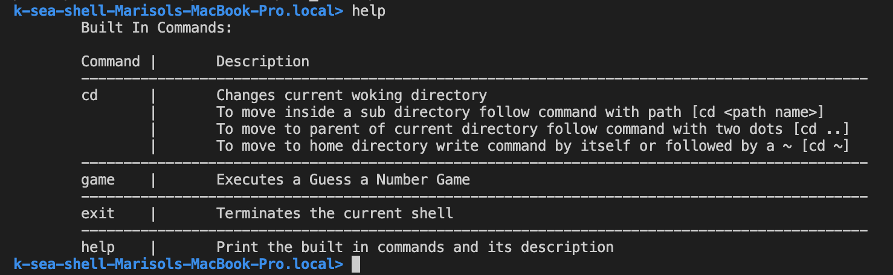

# Shell Commands Implemented
- ```cd``` : Allows the change of directory inside the shell

- ```help``` : Prints descrition of shell commands


- ```game``` : Executes a Guessing Game


- ```exit``` : Terminates the current shell


- Any other basuc UNIX command is recognize by the shell


# Running
```make run```